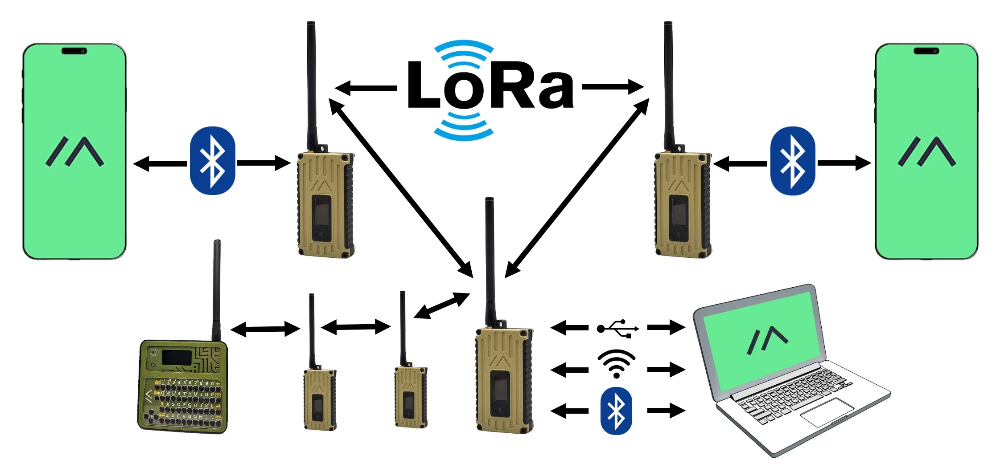

# SkyBridge Alaska
## Aviation Safety Mesh Network
*Saving Lives Through Community-Powered Infrastructure*

A decentralized, community-operated mesh network providing critical aviation safety data to pilots in Alaska's remote airspace. 

**The problem is real and deadly:** As [The Washington Post](https://www.adn.com/aviation/article/alaska-s-outdated-maps-make-flying-peril-high-tech-fix-gaining-ground/2014/10/15/) and [Anchorage Daily News reported](https://www.adn.com/aviation/article/alaska-s-outdated-maps-make-flying-peril-high-tech-fix-gaining-ground/2014/10/15/), terrain mapping errors of 263+ feet contributed to fatal crashes, with one expert noting *"Mars is better mapped than the state of Alaska."* Traditional government solutions remain stuck in budget gridlock after decades.

**SkyBridge is the breakthrough:** A $50 peer-to-peer solution that bypasses failed government infrastructure.

### The Crisis (Validated by The Washington Post, CDC, NTSB)
- **Alaska pilots are 36x more likely to die** than the average US worker *(CDC)*
- **Terrain maps contain errors up to 263+ feet** - directly contributing to fatal crashes *(Washington Post investigation)*
- **15 "controlled flight into terrain" crashes since 2008** killed 16 people, left 7 seriously injured *(NTSB)*
- **No reliable weather/NOTAM updates** in remote areas covering 80% of Alaska
- **Government mapping solutions stuck in budget gridlock** - $30M needed just to finish Alaska *(Washington Post)*
- **"Mars is better mapped than the state of Alaska"** - Steve Colligan, E-Terra Aviation Safety

### The SkyBridge Solution
SkyBridge creates a **$50 peer-to-peer mesh network** using LoRa radios and NASA's TAIGA ASN.1 protocol to deliver:

🌤️ **Real-time weather updates** - Current conditions from pilots and ground stations  
✈️ **PIREPs from other pilots** - Critical turbulence, icing, and visibility reports  
📡 **NOTAMs and runway conditions** - Runway closures, hazards, and operational updates  
🚨 **Emergency beacon relay** - Automated distress signal forwarding to rescue services  
⛰️ **Terrain warnings** - Enhanced situational awareness in mountainous terrain  

**Key Innovation:** 80% data compression using NASA's TAIGA protocol enables critical safety information to flow over low-bandwidth LoRa networks.

### Technology Stack
- **Hardware**: RAK4631 (nRF52840) + RP2040 dual-processor boards
- **Protocol**: TAIGA ASN.1 for efficient data compression
- **Network**: Meshtastic-based LoRa mesh
- **Interface**: React Native mobile app

### Project Status
✅ **Operational System** - Working Meshtastic devices and aviation app deployed  
🚧 **Active Expansion** - Alaska DOT&PF pilot program scaling statewide  
📋 **Three Provisional Patents Filed** - Protecting core mesh, collision avoidance, and emergency triangulation innovations  
🤝 **Industry Partnerships** - Active collaboration with Meshtastic and Rokland Technologies  
🌐 **Multi-State Interest** - Ready for coordinated deployment nationwide  
⚖️ **IP Protected** - State-owned patents enable confident commercial partnerships  

**This is not a concept - it's working today.** We have functioning hardware, operational mesh networks, and a mobile app delivering real-time aviation data to pilots in Alaska.

### License
Dual licensed:
- AGPL-3.0 for open source use
- Commercial licenses available

### For State Aviation Officials

**Why SkyBridge Matters to Your State:**
- 🏔️ **Rural aviation challenges aren't unique to Alaska** - Montana, Idaho, Wyoming, Colorado face similar terrain and weather risks
- 💰 **$50 nodes vs $200K ground stations** - Economically viable for rural airports and pilot communities  
- 🏛️ **State control, not federal dependency** - Community-operated infrastructure under state oversight
- 📈 **Revenue potential** - Commercial licensing funds ongoing development while keeping core system open source
- 🤝 **Interstate cooperation** - Shared development costs, shared safety benefits

**Ready for Multi-State Pilot Program**
- Technical specifications complete
- NASA TAIGA protocol integration proven
- Alaska DOT&PF partnership established
- Seeking 3-5 additional states for coordinated deployment

### Technical Resources
- 📋 **[Technical Architecture](ARCHITECTURE.md)** - Complete system specifications
- 🔬 **[NASA TAIGA Protocol](https://aviationsystems.arc.nasa.gov/publications/2015/NASA-TM-2015-218427.pdf)** - Official ASN.1 specification
- ⚙️ **[Hardware Specifications](hardware/SPECIFICATIONS.md)** - Component requirements and costs
- 📱 **[Use Cases](USE_CASES.md)** - Real-world application scenarios
- 📊 **[Alaska Aviation Gap Analysis](docs/alaska_aviation_gap_analysis_summary.md)** - Official state study validating SkyBridge's mission
- 📰 **[Media Coverage](docs/media_coverage.md)** - Washington Post investigation and key statistics
- 🔍 **[Existing Solutions Analysis](docs/existing_solutions_analysis.md)** - Why current satellite solutions prove SkyBridge's value
- 📄 **[Technical Whitepaper Summary](docs/technical_whitepaper_summary.md)** - Complete system capabilities and competitive analysis
- 📋 **[Complete Technical Whitepaper](docs/complete_technical_whitepaper.md)** - Full project documentation and deployment strategy
- ⚖️ **[Intellectual Property Overview](docs/intellectual_property_overview.md)** - Patent portfolio protecting core innovations
- 🤝 **[Industry Partnerships](docs/industry_partnerships.md)** - Active collaboration with Meshtastic and Rokland Technologies
- 🌐 **[IoT Sensor Integration](docs/iot_sensor_integration.md)** - Expanding safety through distributed environmental monitoring
- 🎯 **[NASAO Elevator Pitch](docs/elevator_pitch.md)** - Presentation materials for state officials

### Contact
- **Technical**: Steven Fett, Alaska DOT&PF - [sfett@alaska.gov](mailto:sfett@alaska.gov)
- **Project**: https://skybridgealaska.net
- **Repository**: https://github.com/SFETTAK/Skybridge-Alaska

---
*"Alaska pilots are dying at 36 times the national rate because they can't get weather updates in remote areas. We're fixing this with $50 mesh radios that let pilots share critical safety data peer-to-peer. No satellites, no subscriptions, just pilots helping pilots."*
